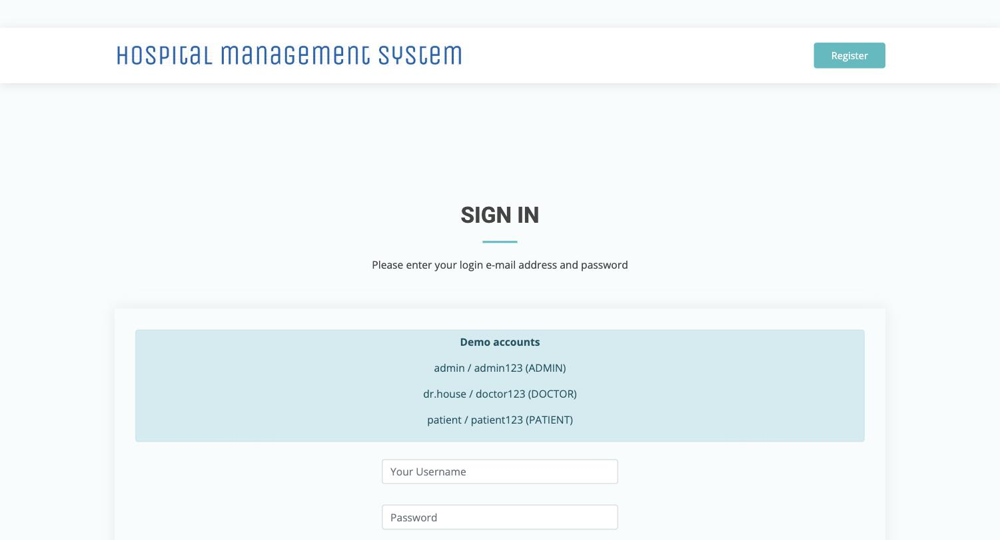
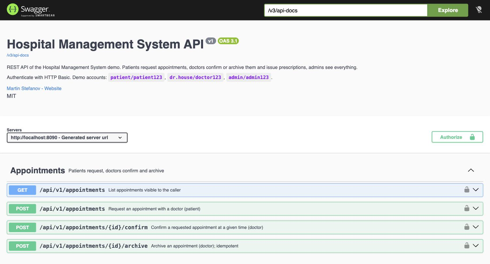
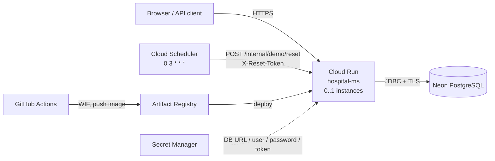

# Hospital Management System

[](https://github.com/MartinStefanov20/hospital-management-system/actions/workflows/ci.yml)


[](LICENSE)

A web application for running a clinic's day-to-day. Patients register and request appointments with
a doctor in a department, doctors confirm or archive appointments and issue prescriptions, and
administrators manage users and roles. Built with Java 21 and Spring Boot 3: Spring Security with
role-based access, JPA with a Flyway-managed PostgreSQL schema, Thymeleaf views, and a documented REST
API (Swagger UI). Tested with JUnit 5 and Testcontainers, packaged as a non-root Docker image, deployed
on Google Cloud Run through GitHub Actions.

**Live demo:** _coming soon_

| Username   | Password     | Role    | What you can do                                              |
|------------|--------------|---------|--------------------------------------------------------------|
| `patient`  | `patient123` | PATIENT | request appointments, read your prescriptions, browse departments |
| `dr.house` | `doctor123`  | DOCTOR  | confirm / archive appointments, issue and edit prescriptions |
| `admin`    | `admin123`   | ADMIN   | everything above plus the role manager                       |

The demo database is reset every night at 03:00 (Europe/Berlin), so feel free to click around.

## 60-second tour

1. **Patient** – sign in as `patient`, open *Appointments -> Make appointment*, pick *Dr. House* and submit.
   The appointment appears with status `REQUESTED` ("TO BE CONFIRMED").
2. **Doctor** – sign in as `dr.house`, open *Appointments -> Requested*, confirm the request with a date
   and time. It moves to *Confirmed*.
3. **Prescription** – from *Confirmed*, click *Issue prescription*, write the notes and save. The
   appointment is archived and the patient now sees the prescription under *Prescriptions*.
4. **Admin** – sign in as `admin`, open *Role manager*, pick a user and change their roles. Their active
   sessions are expired immediately.
5. **API** – open [`/swagger-ui.html`](http://localhost:8080/swagger-ui.html), click *Authorize*, enter
   `patient / patient123` and call `GET /api/v1/appointments`.

## Screenshots

| | |
|---|---|
| **Login** — demo accounts for each role shown on the page | **Swagger UI** — the `/api/v1` REST API, HTTP Basic |
|  |  |
| **Home** | |
|  | |

## Features

- Role-based UI (Thymeleaf + Spring Security 6) for patients, doctors and admins with server-side
  Bean Validation on every form and branded 404 / 403 / 500 pages.
- Appointment lifecycle `REQUESTED -> CONFIRMED -> ARCHIVED`, prescriptions linked to appointments,
  departments with their doctors.
- REST API under `/api/v1` (HTTP Basic, stateless) with role-aware listings, RFC 7807 `ProblemDetail`
  errors (400 with field list, 401, 403, 404, 409) and an OpenAPI 3 document + Swagger UI.
- Schema owned by Flyway (`V1` baseline, `V2` reference data, `V3` column widening); Hibernate runs
  with `ddl-auto=validate`, and an integration test fails the build if entities and schema drift.
- Demo profile that seeds deterministic sample data and a token-protected reset endpoint for the
  nightly Cloud Scheduler job.
- Actuator health with liveness/readiness groups; all secrets via environment variables.

## Architecture



Inside the service: Thymeleaf controllers (`web/`) and REST controllers (`api/v1`) share the same
service layer (`service/`), Spring Data JPA repositories and Flyway-managed PostgreSQL schema.
The `demo/` package is profile-gated and owns seeding and the reset endpoint.

## API

Swagger UI: `/swagger-ui.html` - OpenAPI JSON: `/v3/api-docs`. All endpoints require HTTP Basic.

| Method | Path                                | Who      | Purpose                                             |
|--------|-------------------------------------|----------|-----------------------------------------------------|
| GET    | `/api/v1/appointments`              | any      | patient: own, doctor: assigned to me, admin: all    |
| POST   | `/api/v1/appointments`              | PATIENT  | `{ "doctorUsername": "dr.house" }` -> 201           |
| POST   | `/api/v1/appointments/{id}/confirm` | DOCTOR   | `{ "appointmentTime": "2026-10-01T10:30:00" }`      |
| POST   | `/api/v1/appointments/{id}/archive` | DOCTOR   | idempotent                                          |
| GET    | `/api/v1/departments`               | any      | all departments with doctors                        |
| GET    | `/api/v1/departments/{name}`        | any      | 404 `ProblemDetail` when unknown                    |
| GET    | `/api/v1/prescriptions`             | any      | role-aware like appointments                        |
| POST   | `/api/v1/prescriptions`             | DOCTOR   | `{ "patientId", "appointmentId"?, "notes" }` -> 201 |

```bash
curl -u patient:patient123 https://<host>/api/v1/appointments
curl -u patient:patient123 -H 'Content-Type: application/json' \
     -d '{"doctorUsername":"dr.house"}' https://<host>/api/v1/appointments
```

## Run locally

Prerequisites: Java 21, Docker.

**Docker Compose** (application + PostgreSQL 16):

```bash
cp .env.example .env          # set POSTGRES_PASSWORD
docker compose up --build     # http://localhost:8080
```

**Maven against your own PostgreSQL** (the `local` profile expects `localhost:5433/hospital`,
user `postgres` / `password`, and activates the `demo` profile):

```bash
./mvnw spring-boot:run -Dspring-boot.run.profiles=local
```

Override the datasource with `SPRING_DATASOURCE_URL`, `SPRING_DATASOURCE_USERNAME`,
`SPRING_DATASOURCE_PASSWORD`; set `DEMO_RESET_TOKEN` to enable `POST /internal/demo/reset`.

## Tests

```bash
./mvnw -B verify
```

Surefire runs the unit and MockMvc tests (`*Test`), Failsafe the Testcontainers integration tests
(`*IT`) on `postgres:16-alpine`. Docker must be available. Colima users:
`export DOCKER_HOST=unix://$HOME/.colima/default/docker.sock TESTCONTAINERS_DOCKER_SOCKET_OVERRIDE=/var/run/docker.sock`.

Highlights: `HospitalManagementSystemApplicationIT` boots the full context on a fresh database, so it
fails whenever Flyway migrations and JPA entities disagree; `SecurityRulesTest` pins the authorization
rules of both filter chains; `AppointmentApiControllerTest` asserts the `ProblemDetail` shapes.

## Deploy

See [docs/DEPLOY.md](docs/DEPLOY.md) for Cloud Run + Neon (secrets, Workload Identity Federation,
nightly reset job), the Kubernetes manifests under `deploy/`, and local container runs.

## Project structure

```
src/main/java/dev/mstefanov/hms
├── api/               ApiExceptionHandler (ProblemDetail) and v1/ REST controllers + record DTOs
├── config/            OpenApiConfig
├── configurations/    SecurityConfig (two filter chains), shared beans
├── demo/              demo profile: seeding, reset endpoint, login hints
├── exception/         NotFoundException, ConflictException
├── model/             JPA entities, binding / service / view models
├── repository/        Spring Data JPA repositories
├── service/           business logic (impl/)
└── web/               Thymeleaf controllers, GlobalExceptionHandler
src/main/resources
├── db/migration/      Flyway V1 baseline, V2 statuses, V3 name columns
├── templates/         Thymeleaf views, error/ pages
└── application*.yml   environment-driven configuration
src/test/java          unit tests (*Test) and Testcontainers ITs (*IT)
deploy/                kustomization.yaml + k8s/ manifests
docs/DEPLOY.md         deployment guide
.github/workflows      ci.yml, deploy-cloud-run.yml
Dockerfile, compose.yaml
```

## License

[MIT](LICENSE) - Copyright (c) 2026 Martin Stefanov
